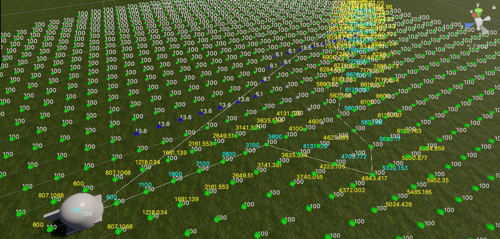

# A* Navigation

A custom solution for when the unity default navmesh doesn't cut it.

With this, you can define certain areas that your navigation agents will ignore or prefer by messing with their weights. 

## Components

### AstarMesh
The mesh where navigation nodes will be created and stored. 

There can be any number of these meshes.

### AstarNavigator

Any object that will be able to navigate the mesh will need this component.

### AstarAreaAffect

Used to dynamically change the mesh node weights/costs and to set certain nodes to impassible.

## TODO
- [ ] Fix relation between cost and distance that lead to navigator ignoring lowest cost areas in certain conditions
- [ ] Optional navigator search nearest "road" first
- [ ] Navmesh manager, join multiple meshes and remove the need to assign mesh to navigator and/or affect
- [ ] Threaded mesh generation/loading
- [ ] Navigator speed and lookat settings
- [ ] Navigator/node max slope
- [ ] Navigator jump nodes